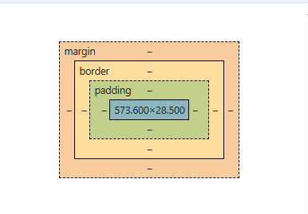

# Box Model in CSS

- The Box model comprises the set of properties that define parts of an element that take up space on a web page.

- **The properties include:**
   (i) Width and Height of the content area.
   (ii)**Border:-** The thickness and style of the border surrounding content area and padding.
   (iii) **Padding:-** Amount of space between content area and border.
   (iv) **Margin:-** Amount of space between border and outside edge of element.

   